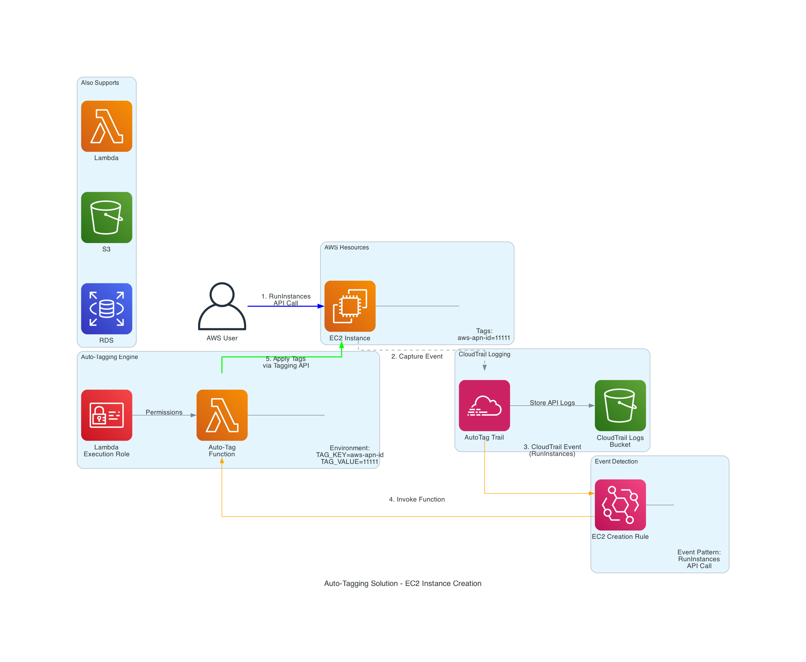
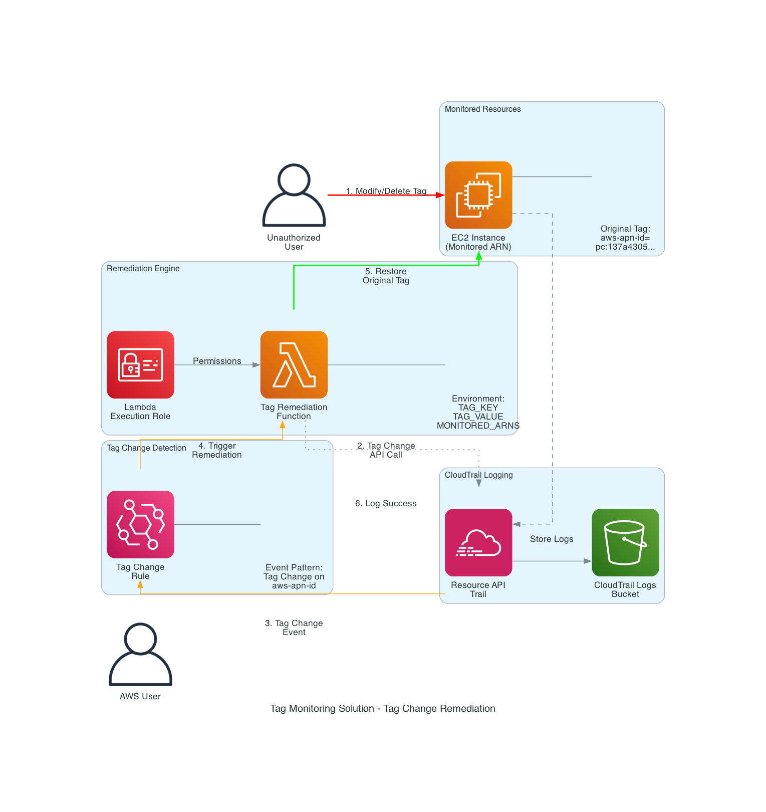

# AWS Resource Tag Automation Solution

## Overview

This repository contains CloudFormation templates for automated AWS resource tagging and tag remediation, designed for compliance with the Partner Revenue Measurement (PRM) program and other governance requirements.

## Solution Components

1. **Auto-Tagging** (`deployment/auto-tagging.yaml`): Automatically tags newly created AWS resources (EC2, RDS, S3, Lambda)
2. **Tag Monitoring & Remediation** (`remediation/ec2-tag-monitor.yaml`): Monitors and automatically restores critical tags if modified or removed

## Risk Assessment

**IMPORTANT:** Before deploying this solution, please review the comprehensive [Risk Assessment](RISK_ASSESSMENT.md) document, which covers:

- Security risks (IAM permissions, tag conflicts, Lambda security)
- Operational risks (automatic remediation overrides, Lambda failures)
- Cost implications (CloudTrail storage, Lambda invocations)
- Compliance considerations (audit trails, data retention, privacy)

### Critical Action Items Before Deployment

1. Enable S3 versioning for CloudTrail buckets
2. Implement S3 Object Lock for audit trail immutability
3. Restrict IAM permissions from wildcard to specific resources
4. Implement emergency override mechanism for tag changes
5. Configure KMS encryption for CloudTrail logs

See [RISK_ASSESSMENT.md](RISK_ASSESSMENT.md) for complete details and mitigation strategies.

## Getting Started

### Prerequisites

- AWS Account with appropriate permissions
- AWS CLI configured
- CloudFormation deployment permissions

### Deployment

1. **Review the Risk Assessment** (mandatory):
   ```bash
   cat RISK_ASSESSMENT.md
   ```

2. **Deploy Auto-Tagging Solution**:
   ```bash
   aws cloudformation create-stack \
     --stack-name prm-auto-tagging \
     --template-body file://deployment/auto-tagging.yaml \
     --parameters ParameterKey=AutoTagKey,ParameterValue=aws-apn-id \
                  ParameterKey=AutoTagValue,ParameterValue=pc:YOUR-ID-HERE \
     --capabilities CAPABILITY_IAM
   ```

3. **Deploy Tag Monitoring & Remediation**:
   ```bash
   aws cloudformation create-stack \
     --stack-name prm-tag-monitor \
     --template-body file://remediation/ec2-tag-monitor.yaml \
     --parameters ParameterKey=OriginalTagKey,ParameterValue=aws-apn-id \
                  ParameterKey=OriginalTagValue,ParameterValue=pc:YOUR-ID-HERE \
                  ParameterKey=ResourceArns,ParameterValue="arn:aws:ec2:region:account:instance/i-xxx" \
     --capabilities CAPABILITY_IAM
   ```

### Architecture Diagrams

Visual representations of the solution architecture:

**Auto-Tagging Solution:**



**Tag Monitoring & Remediation Solution:**



### Auto-Tagging Flow
1. Resource created (EC2, RDS, S3, Lambda)
2. CloudTrail logs API call (5-15 min delay)
3. EventBridge detects creation event
4. Lambda function applies configured tags
5. Resource is tagged with aws-apn-id

### Tag Remediation Flow
1. Tag modified or removed on monitored resource
2. CloudTrail logs tag change (5-15 min delay)
3. EventBridge detects tag change event
4. Lambda function validates resource is monitored
5. Lambda restores original tag value
6. Action logged to CloudWatch for audit

## Cost Estimate

- CloudTrail storage: $1-$10/month
- Lambda invocations: $0.02-$2/month
- EventBridge: $0-$1/month
- **Total: $1-$13/month** (typical workload)

See [RISK_ASSESSMENT.md](RISK_ASSESSMENT.md) Section 3 for detailed cost analysis.

## Security Considerations

This solution requires careful security configuration:

- Lambda functions need broad tagging permissions
- CloudTrail logs contain sensitive API call information
- Automatic remediation may override legitimate changes
- Emergency override mechanism required for incident response

See [RISK_ASSESSMENT.md](RISK_ASSESSMENT.md) for complete security analysis and mitigation strategies.

## Compliance

This solution supports compliance with:
- SOC 2 (audit trail requirements)
- ISO 27001 (information security)
- PCI DSS (logging and monitoring)
- HIPAA (audit controls)

**Note:** Full compliance requires implementing recommendations in [RISK_ASSESSMENT.md](RISK_ASSESSMENT.md).

## Monitoring

Key metrics to monitor:
- Lambda function errors and duration
- EventBridge rule invocations
- CloudTrail delivery delays
- S3 bucket storage costs

## Troubleshooting

Common issues and solutions are documented in the `troubleshooting/` directory.

## License

Copyright (c) 2026 AWS  
Licensed under the MIT License

## Support

For issues or questions:
1. Review the [Risk Assessment](RISK_ASSESSMENT.md)
2. Check the troubleshooting guide
3. Contact your AWS account team
